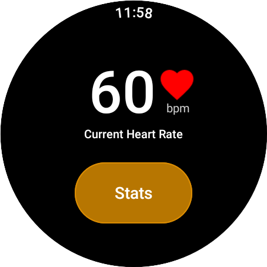
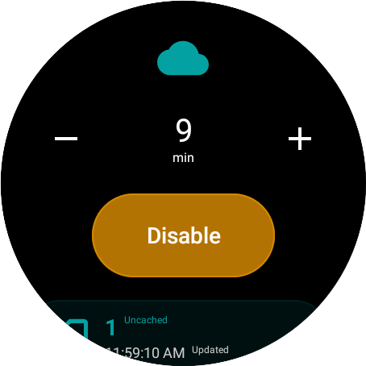
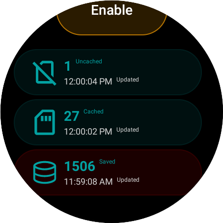

# Mindful Breathing - WearOS

Mindful Breathing app is designed to offer users an interactive experience with their heart rate data, coupled with an educational glimpse into data storage dynamics. With the additional feature of simulating connectivity loss, users can gain insights into how data storage transitions between temporary caching and permanent storage.

## Features

- Heart Rate Monitoring: Utilizes Android's Health Services API to fetch simulated data to display to the user.
- Data Storage Exploration: Dive into the mechanics of data caching and storage, observing how data transitions between temporary memory and the local database.
- Connectivity Simulation: Experience what happens when there's a connectivity loss. Users can set a timer to simulate a connection drop, observing the behavior of the caching system in response.

1. View Heart Rate:

- Launch the app.
- On the main screen, the current heart rate is prominently displayed.
- For more detailed stats, tap the "stats" button.

2. Explore Data Storage:

- Navigate to the secondary activity and scroll down.
- This provides a view into the app's temporary memory, cache, and database storage statuses.

3. Simulate Connectivity Loss:

- Use the stepper buttons to set a desired countdown timer.
- Once set, the database will temporarily disconnect, and you can observe the cache storage's growth in real-time.
- Upon reaching the set timer, the database will come online, processing and moving the cached data to permanent storage.

    
    

